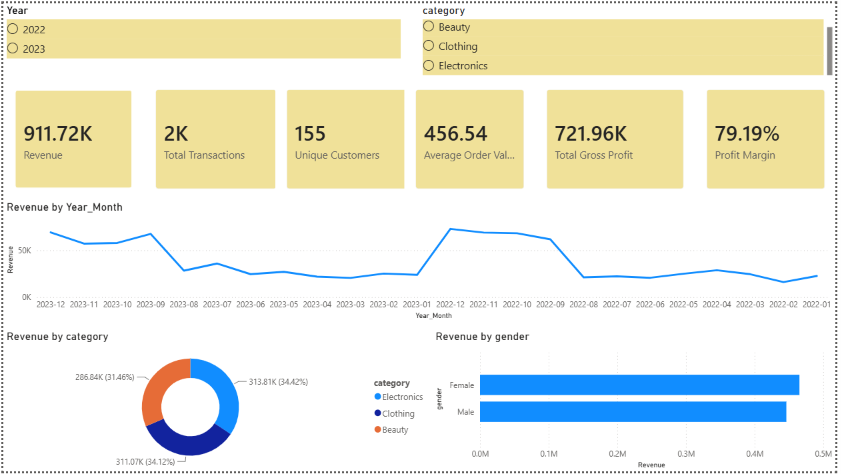
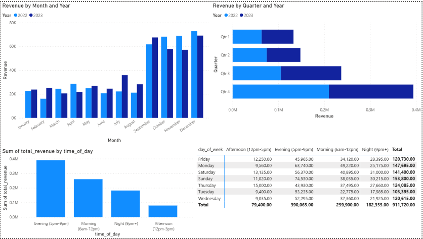
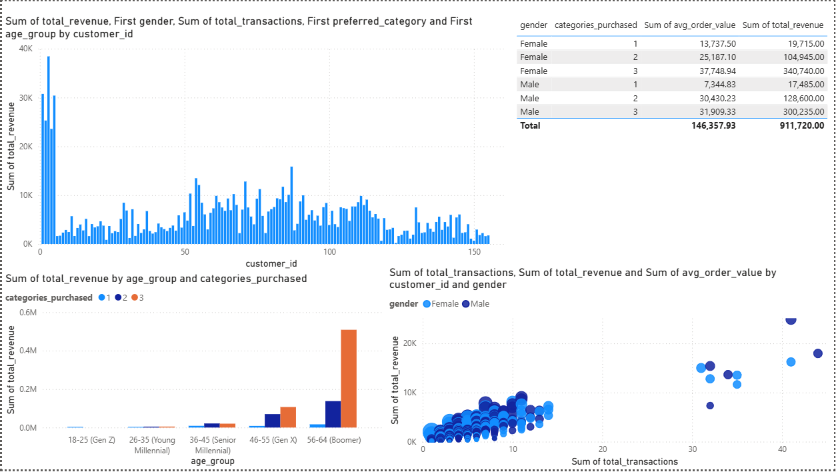
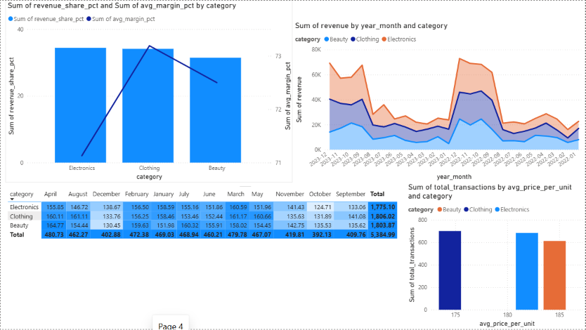
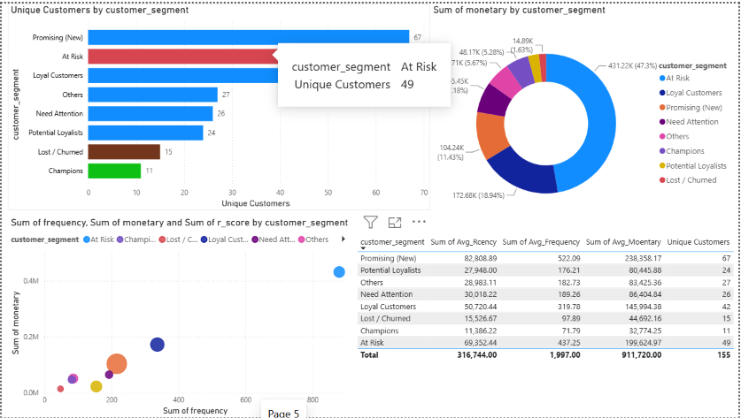

# 🛍️ Retail Intelligence Dashboard

**End-to-end retail analytics project: PostgreSQL data modeling → SQL views → Power BI dashboard → customer segmentation & business recommendations.**


---

## 📌 TL;DR

A retail business with **155 customers** and **2,000 transactions** across 2 years had no structured way to identify high-value customers, peak shopping windows, or category profitability. I built a PostgreSQL → Power BI pipeline that surfaced three concrete decisions:

| Finding | Business Action |
|---|---|
| Top 18 customers ("Champions") drive **~28% of total revenue** | Reallocate retention budget toward loyalty rewards for this segment |
| **63% of daily revenue** occurs in a 5-hour evening window (5–10 PM) | Shift promotional sends and staffing to align with peak demand |
| Revenue **triples in Q4** (₹20K/month → ₹70K+/month) vs. rest of year | Pre-stock inventory 6–8 weeks ahead of the festive season |

---

## 📊 Project at a Glance

| Metric | Value |
|---|---|
| Transactions analyzed | 2,000 |
| Unique customers | 155 |
| Time period | 2022 – 2023 (24 months) |
| Total revenue | ₹9,11,720 |
| Average order value | ₹456 |
| Average gross margin | 72.6% |
| Product categories | Electronics, Clothing, Beauty |
| SQL views built | 14 |
| Dashboard pages | 5 |

---

## 🧩 The Problem

The business had transaction-level data sitting in a database with no analytical layer on top of it. That meant:
- No visibility into **which customers were worth retaining** vs. which had already churned
- No understanding of **when** customers actually shop, so marketing and staffing were not time-aligned
- No category-level profitability view to guide inventory and pricing decisions
- No way to answer "are we growing year-over-year?" without manually pulling numbers

## 🎯 What I Built

1. **A 3-tier SQL data architecture** in PostgreSQL — a single cleaned base view (`vw_clean_sales`) feeding 13 purpose-built analytical views, so every transformation is defined once and reused everywhere
2. **An RFM (Recency, Frequency, Monetary) segmentation model** built entirely in SQL using `NTILE()` window functions — no external ML library required
3. **A 5-page interactive Power BI dashboard** covering Executive Summary, Sales Trends, Customer Analytics, Category Profitability, and Customer Segmentation
4. **DAX time-intelligence measures** (YoY growth, period comparisons) using a custom calendar table

---

## 🖥️ Dashboard Preview

> Add your exported dashboard screenshots to a `/screenshots` folder and reference them below.

**Page 1 — Executive Summary**


**Page 2 — Sales Trends**


**Page 3 — Customer Analytics**


**Page 4 — Category Profitability**


**Page 5 — RFM Segmentation**


---

## 🏗️ Architecture

```
 Raw CSV Data
      │
      ▼
 PostgreSQL (retail_sales table)
      │
      ▼
 vw_clean_sales  ◄── handles nulls, fixes typos, adds derived columns
      │
      ├──► vw_monthly_sales              ├──► vw_rfm_raw → vw_rfm_scores → vw_rfm_segments
      ├──► vw_yoy_comparison             ├──► vw_customer_summary
      ├──► vw_category_performance       ├──► vw_gender_analysis
      ├──► vw_quarterly_performance      ├──► vw_age_analysis
      ├──► vw_profitability_heatmap      ├──► vw_time_of_day_analysis
      └──► vw_executive_kpis             └──► vw_transaction_distribution
      │
      ▼
 Power BI (Import mode)
      │
      ▼
 5-Page Interactive Dashboard
```

---

## 🔍 SQL Highlights

**RFM segmentation using window functions** — no ML libraries, pure SQL:

```sql
CREATE OR REPLACE VIEW vw_rfm_scores AS
SELECT
    customer_id,
    recency_days,
    frequency,
    monetary,
    6 - NTILE(5) OVER (ORDER BY recency_days DESC) AS r_score,
    NTILE(5) OVER (ORDER BY frequency ASC)         AS f_score,
    NTILE(5) OVER (ORDER BY monetary ASC)          AS m_score
FROM vw_rfm_raw;
```

**Year-over-year comparison via conditional aggregation:**

```sql
SELECT
    month_name,
    MAX(CASE WHEN year = 2022 THEN revenue ELSE 0 END) AS revenue_2022,
    MAX(CASE WHEN year = 2023 THEN revenue ELSE 0 END) AS revenue_2023,
    ROUND(
        (MAX(CASE WHEN year = 2023 THEN revenue ELSE 0 END)
       - MAX(CASE WHEN year = 2022 THEN revenue ELSE 0 END))
       / NULLIF(MAX(CASE WHEN year = 2022 THEN revenue ELSE 0 END), 0) * 100, 2
    ) AS growth_pct
FROM monthly_revenue
GROUP BY month_name;
```

Full SQL is in [`/SQL/retail_analytics_views.sql`](SQL/retail_analytics_views.sql) — 14 views covering cleaning, time-series analysis, customer segmentation, and profitability.

---

## 📈 Key Business Insights

**Customer Segmentation (RFM)**
Customers were classified into 6 actionable segments — Champions, Loyal, Potential Loyalists, At-Risk, Need Attention, and Lost. The **At-Risk segment** (historically high spenders who stopped purchasing) represents the single highest-priority win-back opportunity, since reactivating them is cheaper than acquiring new customers.

**Seasonality**
Monthly revenue jumps roughly **3×** from Q1–Q3 baseline to Q4, consistent with festive-season demand. This directly informs inventory planning and campaign timing.

**Shopping Behavior**
Evening hours (5–10 PM) account for the majority of daily revenue — informing when promotional emails, flash sales, and customer support staffing should be concentrated.

**Category Performance**
Electronics, Clothing, and Beauty contribute near-equal revenue shares (~31–34% each), with no single category dominating — a diversification strength, but also a signal that there's no clearly differentiated "hero category" driving the business.

---

## 🛠️ Tech Stack

| Layer | Tool |
|---|---|
| Database | PostgreSQL |
| Data Modeling | SQL Views, CTEs, Window Functions (`NTILE`, `OVER`) |
| Visualization | Power BI Desktop |
| Calculations | DAX (time intelligence, KPI measures) |
| Analysis Technique | RFM Customer Segmentation |

---

## 📁 Repository Structure

```
RETAIL-SALES-ANALYSIS/
│
├── SQL/
│   └── retail_analytics_views.sql      # All 14 PostgreSQL views
│
├── Dashboard/
│   └── retail_dashboard.pbix           # Power BI dashboard file
│
├── Screenshots/
│   ├── page1_executive_summary.png
│   ├── page2_sales_trends.png
│   ├── page3_customer_analytics.png
│   ├── page4_category_profitability.png
│   └── page5_rfm_segments.png
│
├── Dataset/
│   └── retail_sales_sample.csv         # Sample/anonymized dataset
│
└── README.md
```

---

## ▶️ How to Run This Project

1. **Set up PostgreSQL** — create a database and import the dataset into a `retail_sales` table
2. **Run the SQL script** — execute `SQL/retail_analytics_views.sql` to build all 14 views
3. **Connect Power BI** — open Power BI Desktop → Get Data → PostgreSQL → import the views (Import mode)
4. **Open the dashboard** — load `Dashboard/retail_dashboard.pbix` and refresh the data connection

---

## ⚠️ Data Limitations

- Dataset contains category-level data only (no SKU/product-level granularity)
- Gross margin appears uniform (~72%) across all categories, suggesting COGS may be synthetically/proportionally generated rather than reflecting true category-level costs
- No external context (promotions calendar, marketing spend, competitor actions) — seasonality is inferred, not causally proven

## 🚀 Future Enhancements

- [ ] Add SKU-level data for product-level profitability analysis
- [ ] Build a sales forecasting model (Prophet/ARIMA) on top of the monthly trend
- [ ] Automate the SQL → Power BI refresh pipeline with scheduled extracts
- [ ] Add cohort retention analysis by acquisition month

---

## 👤 Author

Sumit Jha
MBA 

---

*If you found this project useful or interesting, consider giving it a ⭐ on GitHub.*